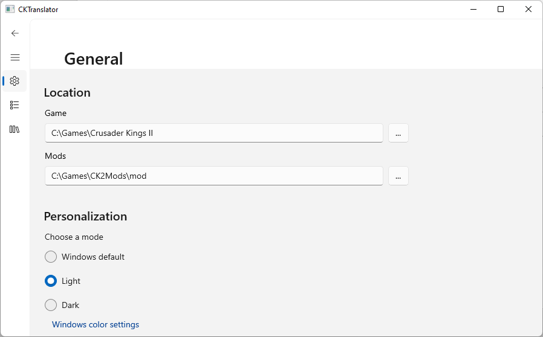
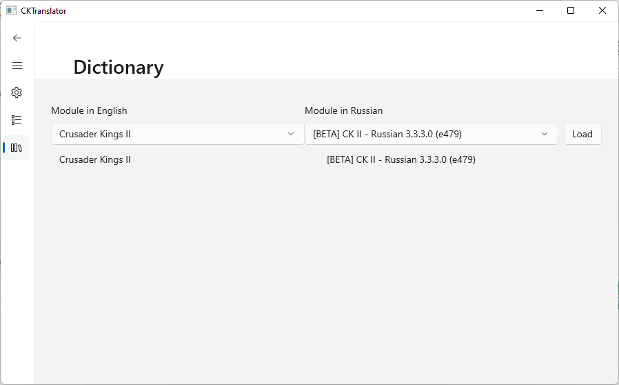
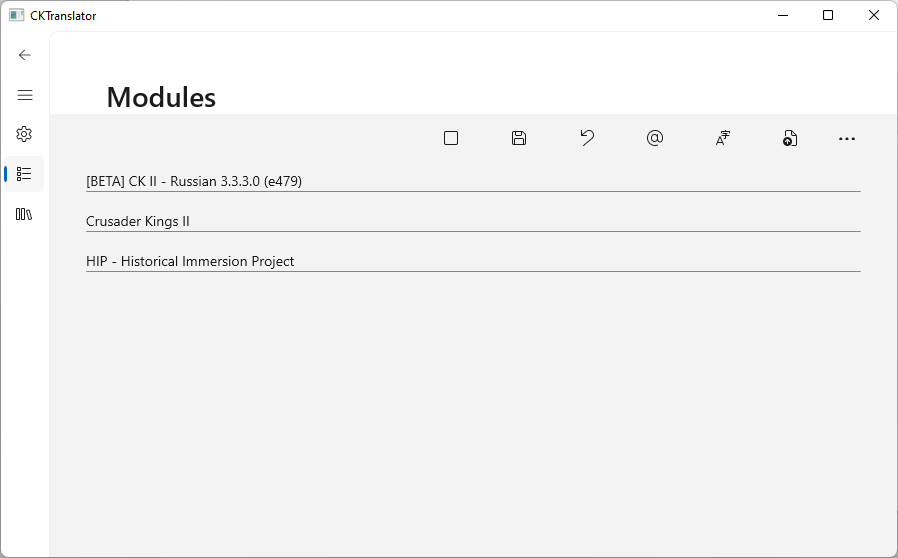

# CKTranslator
Программа для автоматического перевода файлов игры и модов.
На данный момент её можно использовать для переноса перевода на новую версию мода или для перевода названий титулов и имён.

Перевод происходит используя словарь ранее загружённых переводов.
Переводы загружаются сопоставлением идентичных английских и русских модов, и выгрузкой соответствующих строк.

Перевод названий титулов, географических названий и имён происходит используя интеллектуальную транслитерацию, а так же обращаясь к википедии.

## Как использовать

Перед использованием программы трубется её настроить. Укажите путь к папке игры и папке модов:

Что бы перенести перевод модна на другую версию, нужно сначала извлечь перевод.
Для этого надо зайти в раздел "Dictionary", выбрать английскую версию мода и русскую и нажать Load.

Затем перейти в раздел "Modules" выбрать нужную версию мода и нажать "Translate".

Процесс остановить можно кнопкой "Stop". Отменить изменения можно нажатием "Restore".